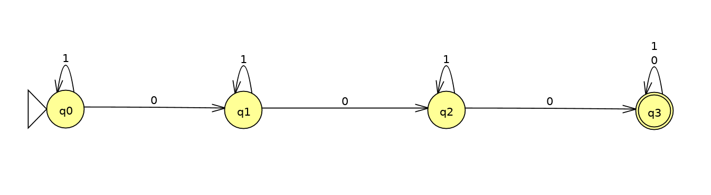
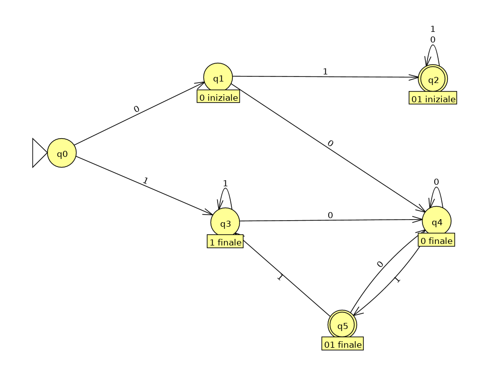
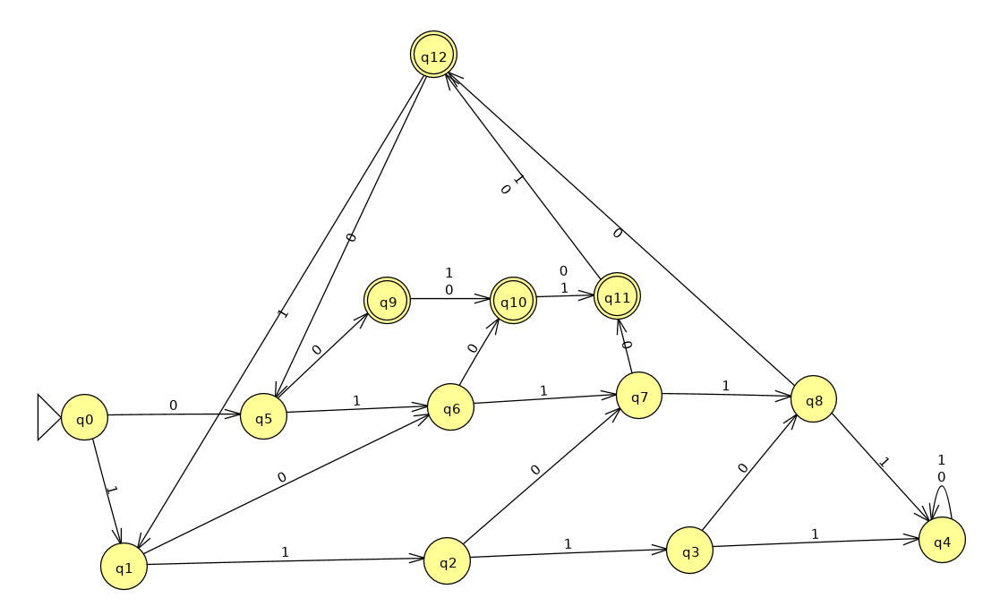
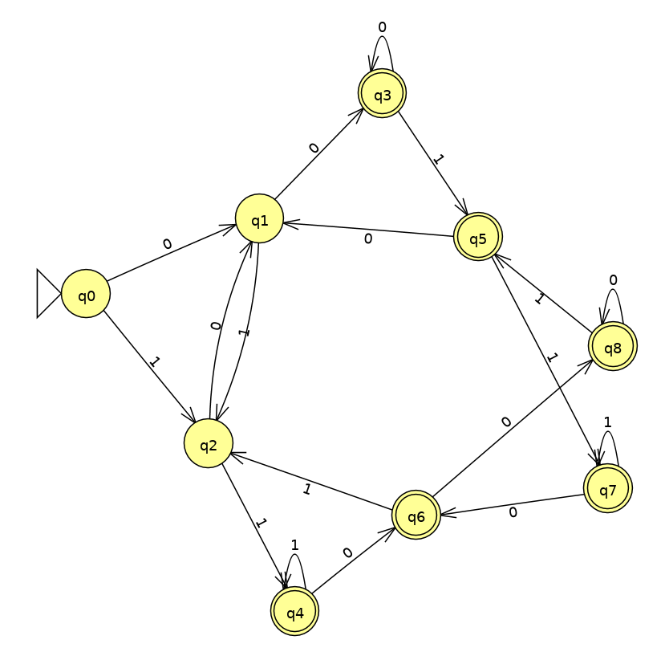
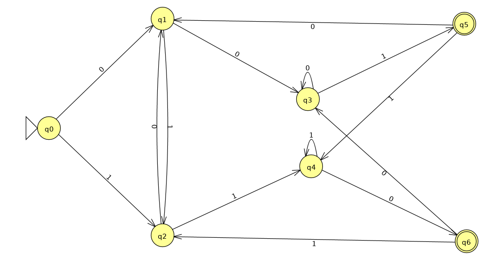
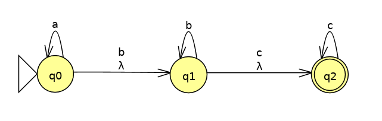
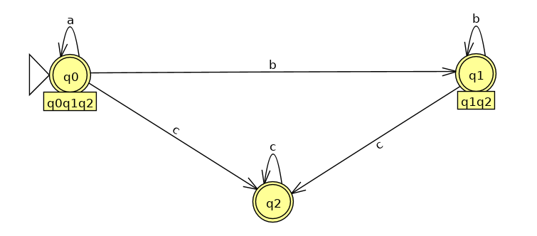

<!-- TOC depthFrom:1 depthTo:6 withLinks:1 updateOnSave:1 orderedList:0 -->

- [Esercizi DFA](#esercizi-dfa)
	- [Esercizi slide 2](#esercizi-slide-2)
		- [Esercizio 3](#esercizio-3)
		- [Esercizio 4](#esercizio-4)
	- [Esercizi extra](#esercizi-extra)
- [Esercizi NFA](#esercizi-nfa)
	- [Esercizi slide 2](#esercizi-slide-2)
		- [Esercizio 2 (pag 24)](#esercizio-2-pag-24)
		- [Esercizio 3 (pag 25)](#esercizio-3-pag-25)
- [Esercizi 	&epsilon;-NFA](#esercizi-epsilon-nfa)
	- [Esercizio slide 3 (pag 18)](#esercizio-slide-3-pag-18)
	- [Esercizio 2.5.3 (b) del libro](#esercizio-253-b-del-libro)
	- [Esercizio conversione NFA -> DFA](#esercizio-conversione-nfa-dfa)
- [Espressioni regolari](#espressioni-regolari)
	- [Esercizi slide 5](#esercizi-slide-5)
		- [Esercizio 1 (pag 14)](#esercizio-1-pag-14)
		- [Esercizio 2 (pag 15)](#esercizio-2-pag-15)
	- [Altri esercizi:](#altri-esercizi)
		- [Esercizio 2 o 3 b](#esercizio-2-o-3-b)

<!-- /TOC -->

# Esercizi DFA
## Esercizi slide 2

### Esercizio 3
DFA che accetta l'insieme di tutte le stringhe in {0, 1}* che contengono 3 zeri anche non consecutivi.

### Esercizio 4
DFA che accetta l'insieme delle stringhe in {0, 1}* che cominciano o finiscono (o entrambe le cose) con 01.

## Esercizi extra
DFA che accetta l'insieme delle stringhe sull'alfabeto {0, 1} tali che ogni blocco di 5 simboli consecutivi contenga almeno due 0.

Ad esempio:
	- `00011 10101`    è accettato
	- `10100 10110 00` è accettato
	- `11011 1010`     non è accettao perchè nel primo blocco manca uno 0

# Esercizi NFA
## Esercizi slide 2

### Esercizio 2 (pag 24)
DFA ottenuto dalla costruzione per sottoinsiemi a partire dall'NFA.

### Esercizio 3 (pag 25)

*Linguaggio riconosciuto dall'automa:* Stringhe in {0, 1}* che  finiscono in 001 oppure 110.

DFA ottenuto con la costruzione per sottoinsiemi dall'automa:

# Esercizi 	&epsilon;-NFA
NB: nei disegni degli esercizi la lettera &epsilon; è equivalente a &lambda;
## Esercizio slide 3 (pag 18)
Automa 	&epsilon;-NFA che accetta tutte le parole costituite da
	-	zero o più 'a'
	-	seguite da zero o più 'b'
	-	seguite da zero o più 'c'
*Costruzione dell'automa &epsilon;-NFA:*

*Calcolo ECLOSE di ogni stato dell’automa:*
	-	ECLOSE(q0) = {q0, q1, q2}
	-	ECLOSE(q1) = {q1, q2}
	-	ECLOSE(q2) = {q2}

*Conversione in DFA:*
(se non ci sono simboli indica l'insieme vuoto, * indica uno stato finale)

|         |    a   |   b  |  c |
| ------- | ------ | ---- | --- |
| -> q0q1q2* | q0q1q2 | q1q2 | q2 |
|  q1q2*  |        | q1q2 | q2 |
|   q2*   |        |      | q2 |

NB: sono state omesse le transizioni verso l'insieme vuoto.

## Esercizio 2.5.3 (b) del libro
&epsilon;-NFA che accetta insieme delle stringhe formate da
	-	`01` ripetuto una o più volte
	-	`010` ripetuto una o più volte
Ho interpretato la consegna in modo che sia permesso mescolare i due casi, ovvero `01 010 01 01 010` è accettato.

*Disegno dell'automa &epsilon;-NFA:*
")

*Conversione in DFA:*

Tabella delle transizioni del DFA:

|         |    0   |    1   |
|:-------:|:------:|:------:|
| -> q0   |   q1   |        |
|    q1   |        | q0q2q3 |
| q0q2q3* | q0q1q3 |        |
| q0q1q3* | q1     | q0q2q3 |

## Esercizio conversione NFA -> DFA
Convertire l'automa con la seguente tabella in DFA

|         |    a   |   b  |
|:-------:|:------:|:------:|
| -> q1*   |  q1q2  |   q3   |
|    q2*   |        |   q4   |
| q3      | q4     |        |
|  q4     |        | q1q4   |

*Conversione in DFA:*

Tabella delle transizioni del DFA:

|         |    a   |    b   |
|:-------:|:------:|:------:|
| -> q1*   |  q1q2  |   q3     |
|  q1q2*   |  q1q2  | q3q4 |
| q3			 | 	q4    |        |
| 	q3q4 	 | q4     | q1q4 |
| 	q1q4*  | q1q2  | q1q3q4  |
| q1q3q4*  | q1q2q4|  q1q3q4  |
| q1q2q4*  | q1q2  | q1q3q4   | <-Ridondante: è sempre q1q4

# Espressioni regolari

## Esercizi slide 5
### Esercizio 1 (pag 14)
Per ognuno dei seguenti linguaggi, costruire una ER sull’alfabeto
{a, b, c} che li rappresenti.

**Punto 1**: stringhe con numero pari di 'a'

Possibile soluzione: `(b+c+a(b+c)*a)*`
Altra soluzione equivalente: `(b+c)*(a(b+c)*a(b+c)*)*`

**Punto 2**: stringhe che contengono '4k + 1' occorrenze di 'b', per ogni k ≥ 0

Possibile soluzione: `((a+c)*b(a+c)*b(a+c)*b(a+c)*b(a+c)*)* (a+c)*b(a+c)*`

**Punto 3**: tutte le stringhe la cui lunghezza è un multiplo di 3

Possibile soluzione:	`((a+b+c)(a+b+c)(a+b+c))*`

### Esercizio 2 (pag 15)
Per ognuno dei seguenti linguaggi, costruire una ER sull’alfabeto
{0, 1} che li rappresenti.

**Punto 1**: tutte le stringhe che contengono la sottostringa `101`

Possibile soluzione: `(0+1)*101(0+1)*`

**Punto 2**: tutte le stringhe che non contengono la sottostringa `101`
NB: eps = &epsilon;

Possibile soluzione: `(0+1+eps)(1+(000*+1))*(0+1+eps)`

## Altri esercizi:
### Esercizio 2 o 3 b
Espressione regolare che accetta tutte le stringhe su &Sigma;={a, b} che contengono esattamente 2 o 3 lettere 'b'

Soluzione: `a*ba*ba*(ba*+a*)`
