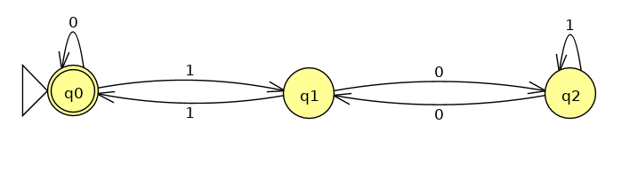
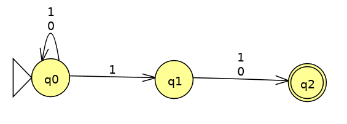
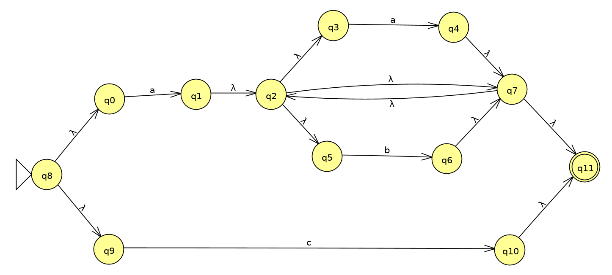
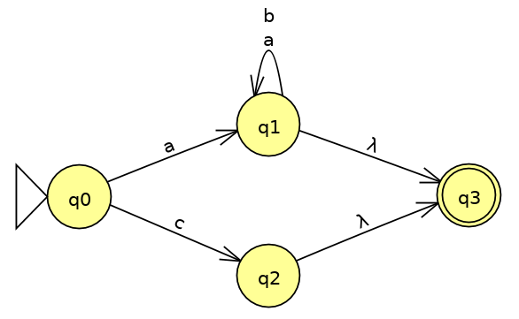
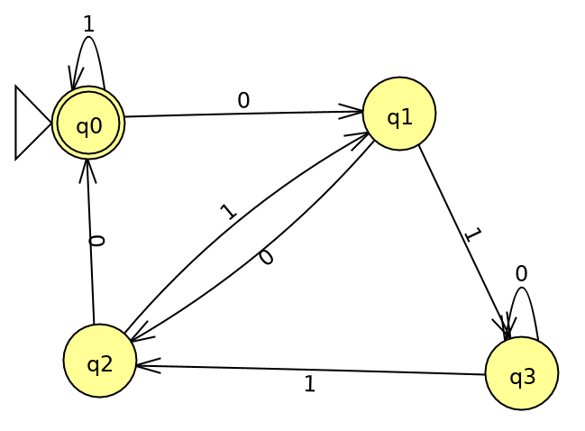

<!-- TOC depthFrom:1 depthTo:6 withLinks:1 updateOnSave:1 orderedList:0 -->

- [Espressioni regolari e conversione NFA-RE / RE-NFA](#espressioni-regolari-e-conversione-nfa-re-re-nfa)
	- [Esercizi slide 5](#esercizi-slide-5)
	- [Esercizio sfida slide 5](#esercizio-sfida-slide-5)
	- [Esercizi slide 6 (pag 7 e 8)](#esercizi-slide-6-pag-7-e-8)
		- [Esercizio	6.1](#esercizio-61)
		- [Esercizio 6.2](#esercizio-62)
		- [Esercizio 6.3](#esercizio-63)
		- [Esercizio 6.4](#esercizio-64)
		- [Esercizio 6.5](#esercizio-65)
		- [Esercizio 6.6](#esercizio-66)
		- [Esercizio 6.7](#esercizio-67)
	- [Esercizi slide 7 (pag 7 e 8)](#esercizi-slide-7-pag-7-e-8)
		- [Esercizio 7.3](#esercizio-73)
		- [Esercizio T1 (3.12.i)](#esercizio-t1-312i)
- [Pumping Lemma](#pumping-lemma)
	- [Esercizi vari](#esercizi-vari)
		- [Esercizio 4.1.2.c libro (pag 138)](#esercizio-412c-libro-pag-138)
		- [Esercizio 3 (slide gioco)](#esercizio-3-slide-gioco)
		- [Esercizio 2 (slide gioco)](#esercizio-2-slide-gioco)
		- [Esercizio 5 (slide 9 pag 9)](#esercizio-5-slide-9-pag-9)
		- [Esercizio 6 (slide 9 pag 9)](#esercizio-6-slide-9-pag-9)
		- [Esercizio 7 (slide 9 pag 9)](#esercizio-7-slide-9-pag-9)
		- [Esercizio T1 (test-assignment 5 i)](#esercizio-t1-test-assignment-5-i)
		- [Esercizio T3 (esame)](#esercizio-t3-esame)

<!-- /TOC -->

# Espressioni regolari e conversione NFA-RE / RE-NFA
## Esercizi slide 5
## Esercizio sfida slide 5

**Sfida**: RE per tutte le stringhe che interpretate come numeri binari rappresentano un multiplo di 3.

Possibile soluzione: `((0+11)+10(1+00)*01)*`
Oppure equivalentemente: `(0 + 1(01*0)*1)*`

DFA corrispondente:

L'automa modella i possibili resti (modulo 3) di ogni stringa binaria interpretata come numero binario. Pertanto accetta solamente se il resto è 0, cioè quando è un multiplo di 3.

## Esercizi slide 6 (pag 7 e 8)
### Esercizio	6.1
Convertire `(0+1)*1(0+1)` in &epsilon;-NFA.

NFA (semplificato)

### Esercizio 6.2
Scrivere un’espressione regolare per rappresentare il linguaggio sull’alfabeto {a, b, c} che contiene:
- tutte le stringhe che iniziano con `a` e sono composte solo di `a` oppure `b`;
- la stringa `c`;

Soluzione: `a(a+b)*+c`

### Esercizio 6.3
Convertire l'esercizio 6.2 in &epsilon;-NFA.

Applicando le regole si ottiene una cosa di questo tipo:

Semplificando un po' di &epsilon;-transizioni si ottiene questo automa equivalente:

### Esercizio 6.4
Espressione regolare per tutte le stringhe binarie che cominciano e finiscono per 1.

Soluzione: `1(0+1)*1+1`

### Esercizio 6.5
Scrivere una espressione regolare per le stringhe binarie che contengono almeno tre `1` consecutivi.

Soluzione: `(0+1)*111(0+1)*`

### Esercizio 6.6
Scrivere una espressione regolare per le stringhe binarie che contengono almeno tre `1`, anche non consecutivi.

Soluzione: `0*1(0+1)*1(0+1)*10*`
Oppure: `(0+1)*10*10*1(0+1)*`

### Esercizio 6.7
Scrivere una espressione regolare per stringhe di testo che descriva le date in formato `GG/MM/AAAA`.
Per comodità definisco delle RE per ciascun componente:
- g = `(0(1+2+...+9) + (1+2)(0+1+...+9) + 3(0+1))` (esclude `00`, `32+`)
- m = `0(1+2+...+9) + 1(0+1+2)` (esclude `00` e `13+`)
- a = `(0+1+...+9)(0+1+...+9)(0+1+...+9)(0+1+...+9)`

Soluzione: `g/m/a` (concateno le tre RE inserendo `/` in mezzo)

## Esercizi slide 7 (pag 7 e 8)
Convertire gli automi in RE, procedendo con l'eliminazione degli stati.

### Esercizio 7.3

Soluzione: `(1+0((0+10*1)1)*(0+10*1)0)*`

### Esercizio T1 (3.12.i)

Soluzione: `(bb*ab+(a+bb*aa)b*a)*(bb*a+(a+bb*aa)b*)`

# Pumping Lemma
## Esercizi vari
### Esercizio 4.1.2.c libro (pag 138)
Dimostrare che L = {0p | 'p' è una potenza di 2} non è regolare.

Prendo una qualunque stringa `w` &isin; `L` tale che:
- w = xyz
- |w| &ge; n, &forall; n &ge; 0
- y &ne; &epsilon;
- |xy| &le; n

Siccome `w` appartiene al linguaggio, allora `|w| = |x| + |y| + |z| = p` con `p` potenza di 2.
Per provare che questo linguaggio non è regolare bisogna trovare un `k` che 'pompando' `y` faccia uscire la parola dal linguaggio.
Scelgo `k = |x| + |z|`. Ora 'pompo' la stringa e ottengo `w'`=xykz;
Ragionando sulla lunghezza di `w'` risulta che:

`|w'| = |x| + |z| + |y|*k = |x| + |z| + |y|*(|x| + |z|) = (|x|+|z|)(|y|+1)`

Visto che `|x| + |y| + |z| = p` è una potenza di due (quindi pari), sono possibili due casi:
- `|y|` è pari ==> `|x|+|z|` è pari, altrimenti `p` non sarebbe pari e nemmeno una potenza di 2
  - ==> `|y|+1` è dispari e il prodotto di un numero pari per un numero dispari non può dare una potenza di 2.
- `|y|` è dispari ==> `|x|+|z|` è dispari
  - ==> `|y|+1` è pari e quindi comunque non posso ottenere una potenza di 2

Pertanto con questa scelta di `k` la stringa `w'` &notin; L.
E quindi, siccome falsifica il PL allora L non può essere regolare.

### Esercizio 3 (slide gioco)
Provare che L è o non è regolare.
L = {w ∈ {a, b}* | numero di `a` è pari, il numero di `b` è dispari}

Sia `n` la lunghezza del PL.
Per dimostrare che non è regolare devo trovare una `w` &isin; `L` con |w| &ge; n tale che:
- y &ne; &epsilon;
- |xy| &le; n
- &exist; `k` per cui xykz &notin; L

Non è possibile trovare una parola che esca dal linguaggio con qualunque split di `w` in `xyz`. Infatti nel caso `y` contenga un numero pari di `a` e di `b` non riusciremo mai a ottenere una parola `w'` che esca dal linguaggio.
E infatti questo linguaggio è regolare, pertanto rispetta il Pumping Lemma.

### Esercizio 2 (slide gioco)
Provare che L non è regolare.
L = {w ∈ {a, b}* | il numero di `a` è maggiore del numero di `b`}

Supponendo che `L` sia regolare prendiamo la parola `w` = an+1bn.

Essa appartiene ad L.

Sia `n` la lunghezza minima della parola (&forall; n &ge; 0).
Sia `xyz` un qualsiasi split tale che:
- y &ne; &epsilon;
- |xy| &le; n

Allora `y` conterrà solamente lettere `a`, in particolare ne avrà almeno una.

Quindi scelgo `k = 0` e ottengo una stringa
`w'`=xy0z. Questa stringa avrà un numero di `a` &le; `n` e pertanto `w'` &notin; `L`.

### Esercizio 5 (slide 9 pag 9)
Il linguaggio L = {13n+2 | n &ge; 0} è regolare?

Rappresenta il linguaggio delle stringhe di '1' di lunghezza pari ad un multiplo di 3, + 2.
È regolare perchè è accettato dall'espressione regolare `(111)*11`.

### Esercizio 6 (slide 9 pag 9)
Il linguaggio L = {0n1m0n | m + n > 0} è regolare?

No, e per dimostrarlo si può mostrare che esso nega il Pumping Lemma.

&forall; `h` &ge; 0 (lunghezza del PL), considero la parola `w` = 0h1h0h.
`w` &isin; L e sicuramente `h` è &ge; 1.

&forall; split `xyz` tale che `y` &ne; &epsilon; e `|xy|` &le; `h` allora `y` conterrà un numero di `1` pari a `p` con 1 &le; `p` &le; `h`.

Allora `w'` = xy0z = 0h-p1h0h

Dato che `(h-p) < h` `w'` &notin; L. Quindi `L` falsifica il PL.

### Esercizio 7 (slide 9 pag 9)
Il linguaggio L = {w ∈ {a, b}* | numero di `a` è due volte il numero di `b`} è regolare?

Non è regolare.

Sia `h` la lunghezza data dal Pumping Lemma.
Prendo la parola `w` = bha2h &isin; L.

&forall; split `xyz` di `w` tale che `y` &ne; &epsilon; e `|xy|` &le; `h`
`y` conterrà un numero di 'b' che chiamo `p` con 1 &le; `p` &le; `h`.
Allora scelgo k = 0 e considero `w'` = xy0z.
`w'` sarà nella forma bh-pa2h.

Visto che `2(h-p) < 2h` `w'` &notin; L. Quindi `L` falsifica il PL e non è regolare.

### Esercizio T1 (test-assignment 5 i)
Dimostrare se L è regolare o meno.

L = {parole nella forma aibjcn | i + j = n, &forall; i,j,n >= 0}

Dimostro che falsifica il PL, che dimostra che L non è regolare.
&forall; `h` bisogna trovare una parola `w` &isin; L, con `|w| >= h` t.c.
&forall; split `w = xyz` con `|xy| <= h` e `y` &ne; &epsilon;
si possa trovare un `k` t.c. xykz &notin; L.

Considero w = ahbhc2h che &isin; L.
Visto `|xy| <= h` per forza `y` conterrà solo lettere `a` (almeno una).
Basta scegliere un qualunque `k` &ne; 1 e w' = xykz non potrà appartenere al linguaggio.
Per esempio con `k = 2` il numero complessivo di `a`, diciamo `i'`, sarà sicuramente maggiore di `h`, e quindi non può essere vero che `i' + h = 2h`.
Segue che `L` falsifica il PL e quindi non è regolare.

### Esercizio T3 (esame)
L = {0n1m0nm | n*m &ne; 0}

L è regolare?

Supponendo che lo sia, allora dovrebbe rispettare il PL &forall; parola.

&forall; `h >= 0`, considero w = 0h1m0h*m.
Considero qualunque split in `xyz` t.c. y &ne; &epsilon; e |xy| &le; h. Quindi `y` deve essere formata da uno o più `0`, ovvero y = 0p, con `p > 0`.
Allora `w'`= xy0z è nella forma 0h-p1m0h*m, e allora `w'` &notin; `L`. Questo perché `(h-p)*m < hm`. Questo linguaggio falsifica il PL, quindi non è regolare.
