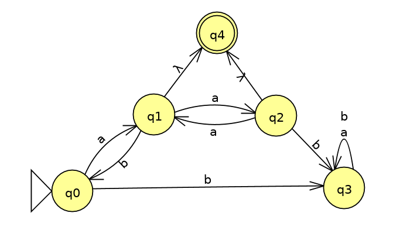
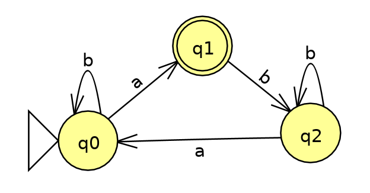
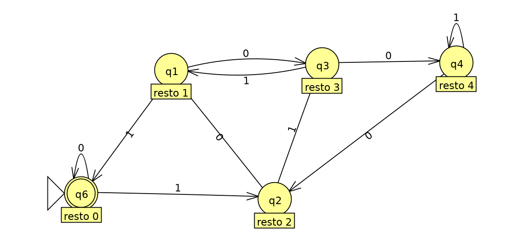

<!-- TOC depthFrom:1 depthTo:6 withLinks:1 updateOnSave:1 orderedList:0 -->

- [Proprietà di chiusura](#propriet-di-chiusura)
	- [Es 4.2.3 pag 155 libro](#es-423-pag-155-libro)
	- [Es T1 (5.1.x)](#es-t1-51x)
- [Conversione FA in RE](#conversione-fa-in-re)
	- [Esercizio T1 (3.12.ii)](#esercizio-t1-312ii)
	- [Esercizio T2 (3.12.iv)](#esercizio-t2-312iv)
- [Pumping Lemma](#pumping-lemma)
	- [Esercizio T1 (5.9)](#esercizio-t1-59)
	- [Esercizio T2 (5.7.ix)](#esercizio-t2-57ix)
	- [Esercizio T3 (5.7.viii)](#esercizio-t3-57viii)
	- [Esercizio T4 (4.1.2.b libro pag 138)](#esercizio-t4-412b-libro-pag-138)
- [Costruzione di DFA](#costruzione-di-dfa)
	- [Esercizio T5 (2.2.6.b pag 57 libro)](#esercizio-t5-226b-pag-57-libro)

<!-- /TOC -->

# Proprietà di chiusura
## Es 4.2.3 pag 155 libro
`a\L` = {w &isin; &Sigma;* | aw &isin; L}
Dimostrare che se `L` è regolare anche `a\L` è regolare.

Si dimostra effettuando una serie di operazioni che mantengono la regolarità.
1. Se L è regolare possiamo disegnare un DFA `M` che accetta L.
2. Possiamo 'invertire' l'automa modificandolo per accettare LR, ovvero tutte le stringhe di L ma rovesciate. Questo automa si chiama `M'` = (QM', &Sigma;, &delta;M', q0, FM').
3. Disegno il DFA `M''` che è uguale a `M'` ma ha come stati finali solamente gli stati di `M'` che hanno una transizione con `a` verso uno stato finale. `M''` = (QM'', &Sigma;, &delta;M'', q0, FM'').
  - &forall; q &isin; QM'
  - &delta;M'(q, a) = p &isin; FM' <==> q &isin; FM''
`M''` accetta stringhe wR sse `M'` accetta wRa. Ovvero il linguaggio di `M''` è L(M'') = {wR | wRa &isin; LR}.
4. Inverto `M''` creando `M'''` che accetta le `w` tali che a(wR)R &isin; (LR)R, ovvero le `w` tali che `aw` &isin; `L`.

`M'''` accetta quindi il linguaggio iniziale che è regolare.

## Es T1 (5.1.x)

`substring(L)` = {`w` | &exist; `x`, `y` | `xwy` &isin; L}.

Dimostrare che se `L` è regolare allora anche `substring(L)` è regolare.

Si parte dall'automa che accetta L. Dato che L è regolare disegno l'automa NFA che lo accetta e lo chiamo M = (Q, &Sigma;, &delta;, q0, F).

Sia `S` l'insieme degli stati raggiungibili da q0 con qualunque cammino, anche &epsilon;. Sia `E` l'insieme degli stati che possono raggiungere uno stato finale di M, ovvero almeno uno stato &isin; `F`.

Disegno un nuovo automa che è uguale a M, ma ha un nuovo stato iniziale qi, e un nuovo (unico) stato finale qf. Costruisco l'NFA:

N = (Q &cup; {qi, qf}, &Sigma;, &delta;, qi, {qf})

Inoltre:
- qi avrà delle &epsilon;-transizioni verso qualunque stato &isin; `S`.
- tutti gli stati &isin; `E` avranno una &epsilon;-transizione verso qf.

In questo modo `N` accetta esattamente il linguaggio `substring(L)`, che quindi è regolare.

# Conversione FA in RE

## Esercizio T1 (3.12.ii)
NB: &epsilon; = λ;

Possibile soluzione: `((λ+aa(aa)*)ab)*(a+aa(aa)*(λ+a))`

## Esercizio T2 (3.12.iv)

Soluzione: `(b+abb*a)*a`

# Pumping Lemma

## Esercizio T1 (5.9)
Dimostrare che `L` non è regolare.
L = {w &isin; {0, 1}* | &exist;u | www = uu}

Se fosse regolare rispetterebbe PL.

&forall; lunghezza `h` prendo la parola `w` = 10h110h1.
Essendo `w` due volte una stessa sequenza (`r` = `s` = 10h1, `w = rs = ss = rr`), `www` sarà spezzabile in due stringhe identiche che concatenate ricostruiscono `www`. Quindi `w` &isin; L.

&forall; possibile split `w = xyz` con |xy| &le; h e y &ne; &epsilon; allora prendo `k` = 0 e la stringa `w'` = xy0z sarà necessariamente in una forma in cui non è più la ripetizione di due sequenze identiche. Diciamo che è nella forma `w = rs` in cui |r| < |s| ed esse non sono uguali.
Quindi `www = rsrsrs`. Non c'è alcun modo di spezzare questa stringa in due pezzi identici, quindi `w'` &notin; L. Segue che L non può essere regolare.

## Esercizio T2 (5.7.ix)
`L` è regolare?

L = {0m1n | m = n}

Verifico che nega il PL.

&forall; lunghezza `h` prendo la parola `w` = 0h1h+h! (&isin; L, |w| &ge; h).

&forall; possibile split `w = xyz` con |xy| &le; h e y &ne; &epsilon;. Allora `y` è formata da `p` zeri, con 1 &le; `p` &le; `h`.

Prendo k = `1 + (h! / p)`.
Allora `w'` = xykz = 0h-p 0p(1 + (h! / p)) 1h+h! = 0h-p 0(p + h!) 1h+h! = 0h-p 0p 0h! 1h+h! = 0h+h! 1h+h!.

Per cui `w'` &notin; L. ==> L non è regolare.

Il fattoriale serve perchè `k` deve essere un intero. `h! / p` è intero perchè `p` &le; `h` e quindi `h!` è sicuramente divisibile per `p`.

## Esercizio T3 (5.7.viii)
`L` = {0n | `n` è un numero composto (non primo)}

Per dimostrarne l'irregolarità si può utilizzare la proprietà di chiusura per complementazione dei linguaggi regolari. Se fosse regolare allora il suo complementare L' = {0n | n è un numero primo} dovrebbe essere regolare. Ma questo non è regolare, il che porta ad una contraddizione. Quindi `L` non è regolare.

## Esercizio T4 (4.1.2.b libro pag 138)
Dimostro che `L` non è regolare.

L = {0n | n è un cubo perfetto}
Sia `n` la lunghezza del PL.

Prendo `w` = 0n3, che è sicuramente un cubo &forall; `n` e |w| &ge; `n`.

&forall; split w = xyz per cui vale:
- |xy| &le; `n`;
- `y` &ne; &epsilon;

Allora `y` contiene `p` zeri, dove 1 &le; p &le; n.
Prendo un `k` = 2. Sia `w'` = xykz.

Dunque `|w'|` = n3-p + 2p = n3+p.

Quindi ripetto a `w` la parola `w'` avrà al più `n` zeri in più. Sono sufficienti per arrivare ad un cubo perfetto?
Il cubo successivo a n3 è (n+1)3.

(n+1)3 = n3 + 3n2 + 2n + 2.

Quindi sarebbe stato necessario incrementare il numero di zeri di 3n2+2n+2 solo per arrivare al cubo successivo, invece `w'` è cresciuta di al più `n` zeri.
Quindi `w'` &notin; L.

# Costruzione di DFA
## Esercizio T5 (2.2.6.b pag 57 libro)
Costruire un DFA che accetta tutte le stringhe che lette al contrario come un numero binario intero siano divisibili per 5.

Per prima cosa basta disegnare il DFA che accetta i multipli di 5 binari (diritti). Poi è sufficiente invertire l'automa con la procedura usuale e si ottiene il DFA richiesto.

