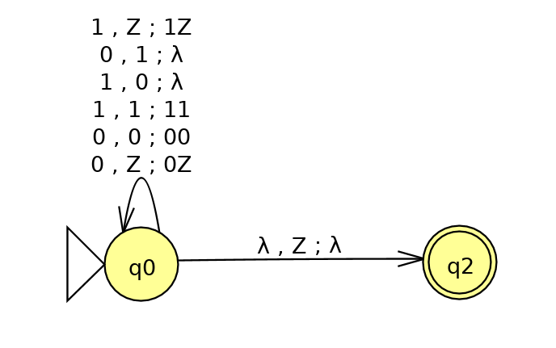
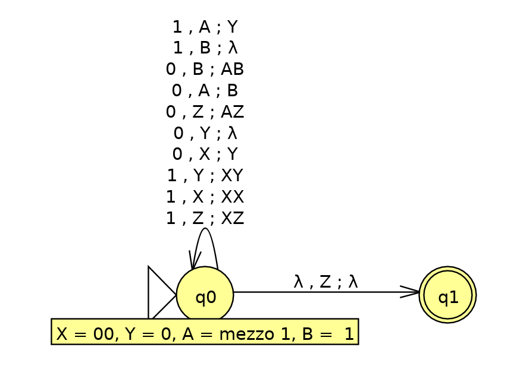
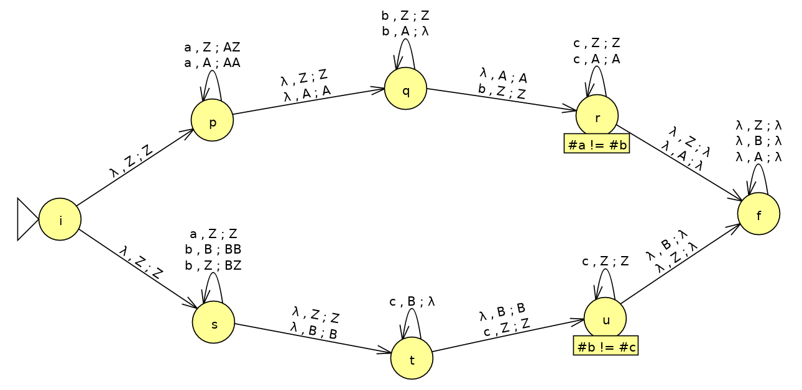

<!-- TOC depthFrom:1 depthTo:3 withLinks:1 updateOnSave:1 orderedList:0 -->

- [Esercizi su automi a pila](#esercizi-su-automi-a-pila)
	- [Esercizi pag 251 del libro](#esercizi-pag-251-del-libro)
		- [Esercizio 6.2.1.c](#esercizio-621c)
		- [Esercizio 6.2.2.b](#esercizio-622b)
		- [Esercizio 6.2.3.a (corretto)](#esercizio-623a-corretto)
- [Conversioni PDA <=> CFG](#conversioni-pda-cfg)
	- [Esercizi pag 261 libro](#esercizi-pag-261-libro)
		- [Esercizio 6.3.1](#esercizio-631)
		- [Esercizio 6.3.3](#esercizio-633)
	- [Altri esercizi](#altri-esercizi)
		- [Esercizio T1](#esercizio-t1)

<!-- /TOC -->

# Esercizi su automi a pila

## Esercizi pag 251 del libro

### Esercizio 6.2.1.c

PDA che accetta stringhe con ugual numero di 0 e 1.

IDEA:

- per ogni 0 che leggo:
  - se in cima alla pila c'è uno `0` o `Z` (Z è il fondo della pila) allora aggiungo uno `0` in cima, per tenere traccia di quanti `0` ho inserito.
  - se in cima alla pila c'è un `1` allora lo rimuovo dalla pila (vuol dire che ho uno `0` per quell'`1`).
- per ogni 1 che leggo:
  - se in cima c'è un `1` oppure `Z` allora ggiungo un `1` alla pila.
  - se in cima alla pila c'è uno `0` allora lo riumovo.

Disegno dell'automa che accetta per stato finale:

### Esercizio 6.2.2.b

PDA che accetta stringhe con numero di 0 doppio del numero di 1.

IDEA: l'alfabeto di stack (&Gamma;) è composto da 5 simboli, che rappresentano ciò che manca per arrivare ad avere una stringa nel linguaggio, e quindi da accettare:

- A: manca mezzo '1';
- B: manca un '1';
- Y: manca uno '0';
- X: mancano due '0';
- Z: non manca nulla (fondo della pila).

Quindi leggendo uno `0` sulla pila succedono cose diverse a seconda del simbolo in cima:

- `X`: diventa `Y`, perchè dei due `0` mancanti ne è stato aggiunto uno;
- `A`: diventa `B`, perchè A + A = B;
- `Y`: diventa &epsilon;, ovvero viene rimosso;
- `Z`: aggiungo la `A`, perchè per ogni 0 va aggiunto 'mezzo' 1.

Leggendo un `1` sarà simile. Bisognerà aggiungere i simboli X e Y in modo che ad ogni 1 corrispondano due 0. In particolare se sulla cima ci fosse `A` allora visto che non è possibile aggiungere mezzo 1, questo simbolo diventerà `Y`, ovvero viene scritto che manca uno 0.

Disegno dell'automa che accetta per stato finale:

### Esercizio 6.2.3.a (corretto)

Automa a pila che accetta stringhe in {aibjck | i &ne; j oppure j &ne; k}.

L'automa usa il non determinismo per esplorare le due possibilità:
- accetta un numero di 'a' seguite da un numero differente di 'b', e infine un numero qualunque di 'c'
- accetta un numero qualunque di 'a' e controlla che il numero di 'b' e 'c' sia diverso

Quindi accetta se almeno uno dei due rami arriva soddisfa la sua condizione accettante.

L'automa, che accetta per stack vuoto, è così definito:

N = ({i, f, p, q, r, s, t, u}, {a, b, c}, {Z, A, B}, &delta;, i, Z).

Disegno di N:

# Conversioni PDA <=> CFG

## Esercizi pag 261 libro

### Esercizio 6.3.1
Convertire la grammatica in PDA.

- S => 0S1 | A
- A => 1A0 | S | &epsilon;

Regola: Sia G = (V, T, P, S) la CFG. L'automa costruito sarà:

N = ({q}, &Sigma; = T, &Gamma; = T &cup; V, &delta;, q, S)

- Per ogni variabile `X` definisco una transizione &delta;(q, &epsilon;, X) = {(q, &beta;) | X => &beta; è una produzione di G}
- Per ogni terminale `t` aggiungo una transizione: &delta;(q, t, t) = {(q, &epsilon;)}

Quindi nella grammmatica data `V = {S, A}` e `T = {0, 1}`. Applicando la regola si ottengono le seguenti transizioni di N:

- &delta;(q, &epsilon;, S) = {(q, 0S1), (q, A)}
- &delta;(q, &epsilon;, A) = {(q, 1A0), (q, S), (q, &epsilon;)}
- &delta;(q, 0, 0) = {(q, &epsilon;)}
- &delta;(q, 1, 1) = {(q, &epsilon;)}

### Esercizio 6.3.3
Convertire in CFG il PDA `P` = ({p, q}, {0, 1}, {X, Z}, &delta;, q, Z) con le transizioni:
1. &delta;(q, 1, Z) = {(q, XZ)}
2. &delta;(q, 1, X) = {(q, XX)}
3. &delta;(q, 0, X) = {(p, X)}
4. &delta;(q, &epsilon;, X) = {(q, &epsilon;)}
5. &delta;(p, 1, X) = {(p, &epsilon;)}
6. &delta;(p, 0, Z) = {(q, Z)}

La CFG equivalente sarà composta dalle seguenti produzioni:
(i numeri fra '()' indicano da quale transizione proviene la produzione)
- S => [qZp] | [qZq]
- (1) [qZq] => 1[qXp][pZq] | 1[qXq][qZq]
- (1) [qZp] => 1[qXq][qZp] | 1[qXp][pZp]
- (2) [qXq] => 1[qXq][qXq] | 1[qXp][pXq]
- (2) [qXp] => 1[qXq][qXp] | 1[qXp][pXp]
- (3) [qXq] => 0[pXq]
- (3) [qXp] => 0[pXp]
- (4) [qXq] => &epsilon;
- (5) [pXp] => 1
- (6) [pZq] => 0[qZq]
- (6) [pZp] => 0[qZp]

## Altri esercizi

### Esercizio T1
Convertire in CFG l'automa dell'[esercizio 6.2.1.c](#esercizio-621c) (`#0 = #1`). Le produzioni sono:

1. &delta;(q, 1, Z) = {(q, 1Z)}
2. &delta;(q, 0, Z) = {(q, 0Z)}
3. &delta;(q, 0, 1) = {(q, &epsilon;)}
4. &delta;(q, 1, 0) = {(q, &epsilon;)}
5. &delta;(q, 1, 1) = {(q, 11)}
6. &delta;(q, 0, 0) = {(q, 00)}
7. &delta;(q, &epsilon;, Z) = {(q, &epsilon;)}

Per ottenere meno produzioni il PDA accetta per stack vuoto, in modo da avere un solo stato.

La CFG G equivalente avrà le seguenti produzioni:

- S => [qZq]
- [qZq] => 1[q1q][qZq] | 0[q0q][qZq] | &epsilon; (da transizioni 1, 2, 7)
- [q1q] => 0 | 1[q1q][q1q] (da 3, 5)
- [q0q] => 1 | 0[q0q][q0q] (da 4, 6)
