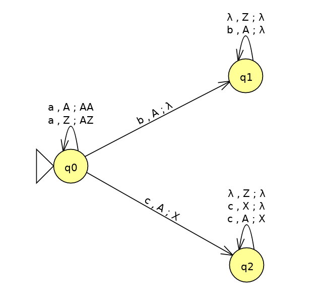
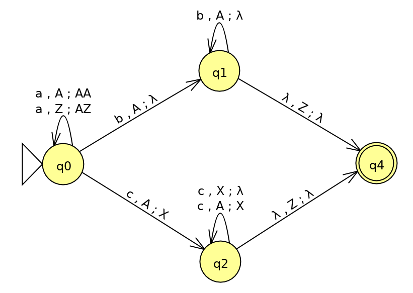
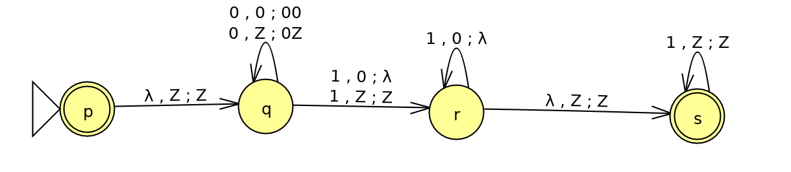
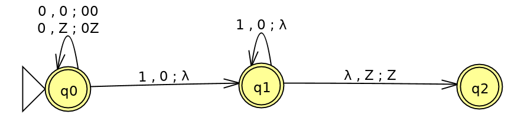
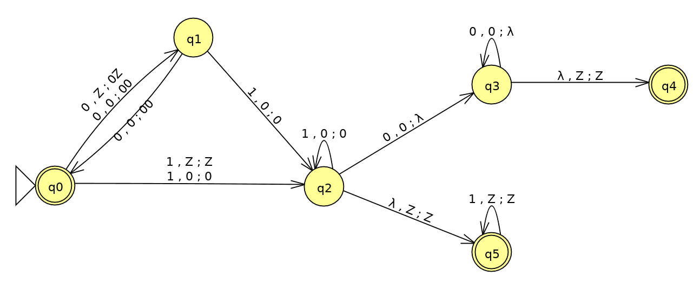
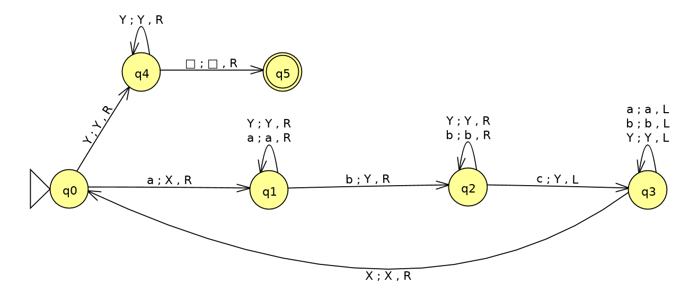
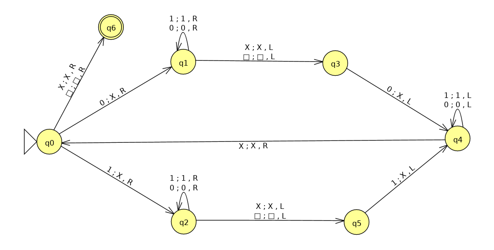

<!-- TOC depthFrom:1 depthTo:3 withLinks:1 updateOnSave:1 orderedList:0 -->

- [Esercizi automi a pila deterministici (DPDA)](#esercizi-automi-a-pila-deterministici-dpda)
	- [Esercizi vari](#esercizi-vari)
		- [Esercizio T1](#esercizio-t1)
		- [Esercizio T2](#esercizio-t2)
	- [Esercizi pag 267](#esercizi-pag-267)
		- [Esercizio 6.4.1.a](#esercizio-641a)
		- [Esercizio 6.4.1.c](#esercizio-641c)
		- [Esercizio 6.4.2.a](#esercizio-642a)
		- [Esercizio 6.4.2.b](#esercizio-642b)
		- [Esercizio 6.4.2.c](#esercizio-642c)
- [Esercizi CFL](#esercizi-cfl)
	- [Esercizi pag 286](#esercizi-pag-286)
		- [Esercizio 7.1.2](#esercizio-712)
		- [Esercizio 7.1.3](#esercizio-713)
		- [Esercizio 7.1.4](#esercizio-714)
		- [Esercizio 7.1.6](#esercizio-716)
	- [Altro esercizio](#altro-esercizio)
		- [Esercizio T3](#esercizio-t3)
- [Macchine di Touring](#macchine-di-touring)
	- [Esercizi pag 347](#esercizi-pag-347)
		- [Esercizio 8.2.1.b](#esercizio-821b)
		- [Esercizio 8.2.2.b](#esercizio-822b)
		- [Esercizio 8.2.2.c](#esercizio-822c)

<!-- /TOC -->

# Esercizi automi a pila deterministici (DPDA)

## Esercizi vari

### Esercizio T1
Definire un DPDA per il linguaggio L che accetti per stack vuoto. Poi convertirlo in DPDA che accetta per stato finale.

L = {anbn | n &ge; 1} &cup; {anc2n | n &ge; 1}

Visto che `L` gode della proprietà del prefisso è possibile accettarlo con un DPDA anche per pila vuota.

Accettazione per pila vuota:

Conversione in DPDA che accetta per stato finale:

Cioè è sufficiente spostare le transizioni che svuotano lo stack sulle transizioni verso lo stato finale accettante.

### Esercizio T2
L'esercizio T1 del tutorato 7 è deterministico?

No, infatti esistono le due transizioni:
- &delta;(q1, b, A) = {(q1, &epsilon;)}
- &delta;(q1, &epsilon;, A) = {(q1, &epsilon;)}

## Esercizi pag 267

### Esercizio 6.4.1.a
PDA P che accetta palindromi pari. È deterministico?

La definizione di P è la seguente:

P = ({q, p, f}, {0, 1}, {0, 1, Z}, &delta;, q, Z, {f})

Transizioni:

1. &delta;(q, 0, Z) = {(q, 0Z)}
2. &delta;(q, 1, Z) = {(q, 1Z)}
3. &delta;(q, 0, 0) = {(q, 00)}
4. &delta;(q, 0, 1) = {(q, 01)}
5. &delta;(q, 1, 0) = {(q, 10)}
6. &delta;(q, 1, 1) = {(q, 11)}
7. &delta;(q, &epsilon;, Z) = {(p, Z)}
8. &delta;(q, &epsilon;, 0) = {(p, 0)}
9. &delta;(q, &epsilon;, 1) = {(p, 1)}
10. &delta;(p, 0, 0) = {(p, &epsilon;)}
11. &delta;(p, 1, 1) = {(p, &epsilon;)}
12. &delta;(p, 0, 0) = {(p, &epsilon;)}
13. &delta;(p, &epsilon;, Z) = {(f, Z)}

Un automa a pila è deterministico se, &forall; `q`, `a`, `X` valgono questi punti:

- &delta;(q, a, X) contiene una sola coppia;
- se &delta;(q, a, X) contiene una coppia, allora &delta;(q, &epsilon;, X) deve essere vuoto.

Quindi l'automa `P` non è deterministico. Ad esempio le transizioni 2 e 7, 3 e 8 violano la seconda proprietà.

D'altronde questo linguaggio non ha la proprietà del prefisso, quindi non potrebbe essere accettato da un DPDA.

### Esercizio 6.4.1.c
PDA `P` = ({p, q}, {0, 1}, {X, Z}, &delta;, q, Z) con le transizioni:

1. &delta;(q, 1, Z) = {(q, XZ)}
2. &delta;(q, 1, X) = {(q, XX)}
3. &delta;(q, 0, X) = {(p, X)}
4. &delta;(q, &epsilon;, X) = {(q, &epsilon;)}
5. &delta;(p, 1, X) = {(p, &epsilon;)}
6. &delta;(p, 0, Z) = {(q, Z)}

In questo caso le transizioni 3 e 4 violano la seconda regola. Quindi `P` è un automa a pila non deterministico.

### Esercizio 6.4.2.a
Definire DPDA per il linguaggio L = {0n1m, _n_ &le; _m_}

### Esercizio 6.4.2.b
Definire DPDA per il linguaggio L = {0n1m, _n_ &ge; _m_}

Nessuno dei due linguaggi degli ultimi due esercizi ha la proprietà del prefisso, quindi non potrebbero essere accettati da DPDA che accettano per stack vuoto.

### Esercizio 6.4.2.c
Definire DPDA per il linguaggio L = {0n1m0n, con _n_, _m_ arbitrari}

P = ({q0, q1, q2, q3, q4, q5}, {0, 1}, {Z, 0}, &delta;, q0, Z, {q0, q4, q5})

Alcuni casi limite:
- 02n è accettata, in quanto le transizioni fra `q0` e `q1` servono proprio ad assicurarsi che la stringa si soli '0' sia di lunghezza pari.
- Anche 1m è accettato. Infatti se `q2` vede una `Z` sullo stack, vuol dire che non sono stati letti '0' perima degli '1', e quindi transita in `q5` che accetta qualunque numero di '1'.
- La stringa vuota è accettata da `q0`.

# Esercizi CFL

## Esercizi pag 286
### Esercizio 7.1.2

Trasformare la CFG:

1. eliminare le &epsilon;-produzioni;
2. eliminare produzioni unitarie;
3. eliminare simgoli inutili (non generatori e non raggiungibili);
4. mettere in forma normale di Chomsky.

CFG:

- S => ASB | &epsilon;
- A => aAS | a
- B => SbS | A | bb

#### 1. Eliminazione &epsilon;-produzioni:

I simboli annullabili sono:
Z = {S}

Sostituiamo ogni simbolo annullabile (in questo caso solo `S`) con la possibilità che ci sia, oppure no:

- S => ASB | AB
- A => aAS | aA | a
- B => SbS | Sb | bS | b | A | bb

#### 2. Eliminazione produzioni unitarie:

Le coppie unitarie sono:

- (S, S) => \
- (A, A) => \
- (B, B) => (B, A)

Quindi ottengo:

- S => ASB | AB
- A => aAS | aA | a
- B => SbS | Sb | bS | b | bb | aAS | aA | a

#### 3. Eliminazione simboli inutili:

- Sia S, A, B sono generatori;
- Inoltre sono anche tutti raggiungibili.

#### 4. Forma normale di Chomsky:

Tutte le produzioni devono essere costituite da 2 variabili oppure da un terminale.

- S => AE | AB
- A => MF | MA | a
- B => GS | SN | NS | b | MF | MA | a | NN
- M => a
- N => b
- E => SB
- F => AS
- G => SN

### Esercizio 7.1.3

Trasformare la CFG:

1. eliminare le &epsilon;-produzioni;
2. eliminare produzioni unitarie;
3. eliminare simgoli inutili (non generatori e non raggiungibili);
4. mettere in forma normale di Chomsky.

- S => 0A0 | 1B1 | BB
- A => C
- B => S | A
- C => S | &epsilon;

#### 1. Eliminazione delle &epsilon;-produzioni;
I simboli annullabili sono: Z = {C, A, B, S}

- S => 0A0 | 00 | 1B1 | 11 | BB | B
- A => C
- B => S | A
- C => S

Questa grammatica accetta lo stesso linguaggio di quella originle, a meno del simbolo &epsilon; (dato che `S` era annullabile).

#### 2. Eliminazione produzioni unitarie

Le coppie unitarie sono:

- (S, S) => (S, B), (S, A), (S, C)
- (A, A) => (A, C), (A, S), (A, B)
- (B, B) => (B, S), (B, A), (B, C)
- (C, C) => (C, S), (C, B), (C, A)

Quindi la grammatica diventa:

- S => 0A0 | 00 | 1B1 | 11 | BB
- A => 0A0 | 00 | 1B1 | 11 | BB
- B => 0A0 | 00 | 1B1 | 11 | BB
- C => 0A0 | 00 | 1B1 | 11 | BB

#### 3. Eliminazione simboli inutili

I generatori sono: &pi; = {0, 1, S, A, B, C}
I raggiungibili sono: R = {S, A, 0, 1, B}

Quindi `C` va rimossa perchè non raggiungibile, ma in realtà si possono rimuovere anche `A` e `B` perchè sono identiche ad `S`.

Quindi rimane:

- S => 0S0 | 00 | 1S1 | 11 | SS

#### 4. Portare a CNF

- S => XE | EE | YF | FF | SS
- X => ES
- Y => FS
- E => 0
- F => 1

### Esercizio 7.1.4

- S => AAA | B
- A => aA | B
- B => &epsilon;

#### 1. Eliminazione &epsilon;-produzioni
I simboli annullabili sono: Z = {B, S, A}
Siccome `B` può produrre solo la stringa vuota, va rimossa, e di conseguenza va tolta anche ogni produzione che contiene `B` nel corpo.

Quindi:

- S => AAA | AA | A
- A => aA | a

Il linuaggio di questa grammatica è identico al precedente tranne per la stringa vuota che non è più possibile produrre.

#### 2. Eliminazione produzioni unitarie

Coppie unitarie:

- (S, S) => (S, A)
- (A, A) => \

Quindi:

- S => AAA | AA | aA | a
- A => aA | a

#### 3. Eliminazione simboli inutili

I generatori sono &pi; = {a, A, S}.
I raggiungibili sono R = {S, A, a}.
Quindi non cambia nulla.

#### 4. Porto in CNF

Devono restare solo produzioni con un terminale oppure due variabili nel corpo.

- S => BA | AA | CA | a
- A => CA | a
- B => AA
- C => a

### Esercizio 7.1.6
Scrivere una grammatica CNF per le stringhe di parentesi bilanciate.

Una possibile grammatica non normalizzata é:

- S => (S) | SS | ()

Che in CNF diventa:

- S => AC | SS | BC
- A => BS
- B => (
- C => )

## Altro esercizio

### Esercizio T3

- S => XY
- X => abb | aXb | &epsilon;
- Y => c | cY

#### 1. Elimino &epsilon;-produzioni:

Solo la variabile `X` è annullabile.

- S => XY | Y
- X => abb | aXb | ab
- Y => c | cY

#### 2. Elimino produzioni unitarie:

Coppie unitarie:

- (S, S) => (S, Y)
- (X, X) => \
- (Y, Y) => \

Quindi basta aggiungere ad `S` le produzioni non unitarie di `Y`:

- S => XY | c | cY
- X => abb | aXb | ab
- Y => c | cY

#### 3. Elimino simboli inutili:
Sono tutti generatori, e sono tutti raggiungibili.

#### 4. Metto in CNF:

- S => XY | c | CY
- X => AD | AE | AB
- Y => c | CY
- C => c
- A => a
- B => b
- D => BB
- E => XB

# Macchine di Touring

## Esercizi pag 347

### Esercizio 8.2.1.b
Descrivere le ID della TM in figura 8.10 (del libro) con la parola in input `000111`.

[q0]000111 -| X[q1]00111 -| X0[q1]0111 -| X00[q2]111 -| X0[q2]0Y11 -| X[q2]00Y11 -| [q2]X00Y11 -| X[q0]00Y11 -| ... riparte dall'inizio ...

### Esercizio 8.2.2.b

TM che accetta L = {anbncn | `n` &ge; 1}.

NB: il simbolo blank si indica con '&#9633;' in JFLAP.

M = ({q0, q1, q2, q3, q4, q5}, {a, b, c}, {X, Y, &#9633;}, &delta;, q0, &#9633;, {q5})

### Esercizio 8.2.2.c

TM che accetta L = {wwR | `w` è una qualunque stringa di 0 e 1}
(palindromi pari).

N = ({q0, q1, q2, q3, q4, q5, q6}, {0, 1}, {X, &#9633;}, &delta;, q0, &#9633;, {q6})

